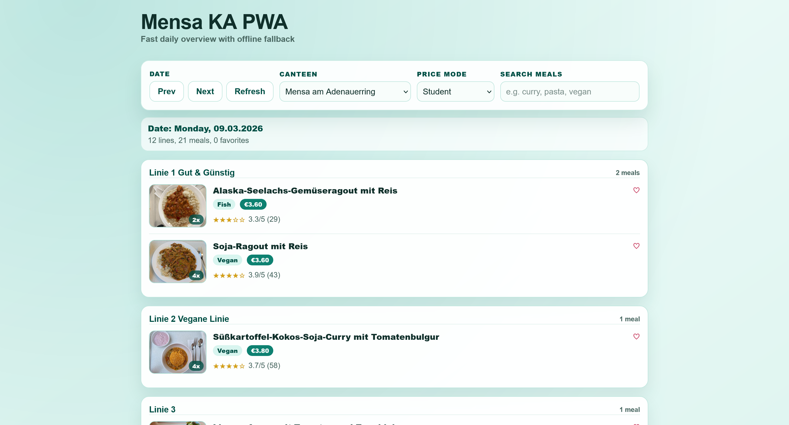

<h1 align="center"> Mensa KA Progressive Web App & CORS Proxy</h1>

<p align="center">

</p>

Cloudflare Worker implementing a Progressive Web App (PWA) and serving a restricted CORS proxy for the `mensa-ka.de` API.
Both the PWA and the proxy are protected through Cloudflare Access, with ZITADEL handling the user login flow behind Access.

## Routes

- `/`: Serves the Progressive Web App
- `/api/`: Proxies the upstream GraphQL API

## Access model

- The Worker is protected with Cloudflare Access backed by ZITADEL.
- `POST /api/` is allowed for same-origin requests and Tailscale origins.
- `GET /api/` for the GraphQL playground is restricted to Tailscale-originated requests.

## Cloudflare Access and ZITADEL

This Worker validates Cloudflare Access JWTs before serving either the PWA or the API.
Cloudflare Access handles policy enforcement, while ZITADEL acts as the upstream identity provider used for authentication.

Configure these variables for deployment:

- `POLICY_AUD`: the Access application audience
- `TEAM_DOMAIN`: your Access team domain, for example `https://your-team.cloudflareaccess.com`

## Local development

```powershell
cd cors-header-proxy
npx wrangler dev
```

For local development, copy `.dev.vars.example` to `.dev.vars` and fill in the values if you want to test Access-backed requests. Requests to `localhost` are allowed without Access validation so `wrangler dev` remains usable.

Open `http://localhost:8787`.
